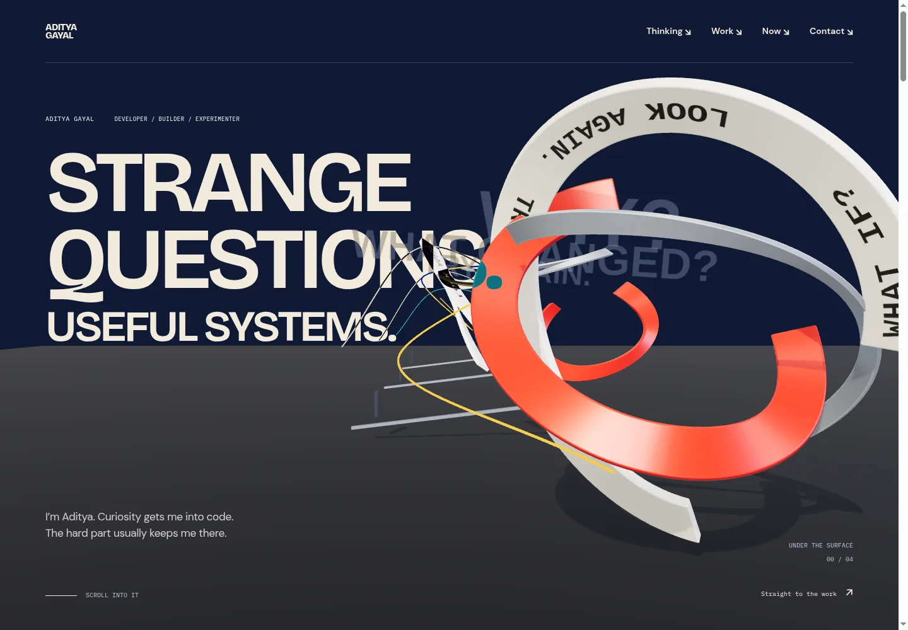
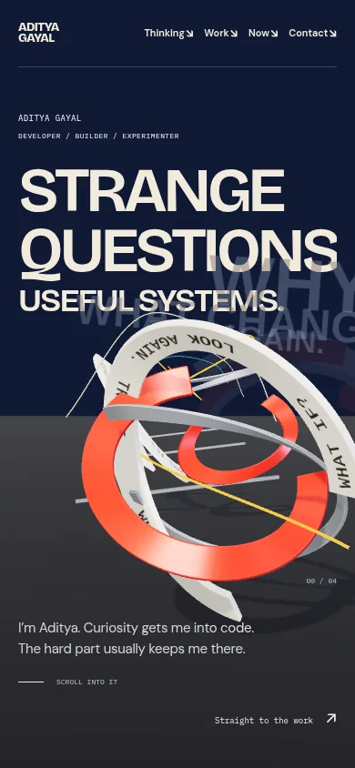
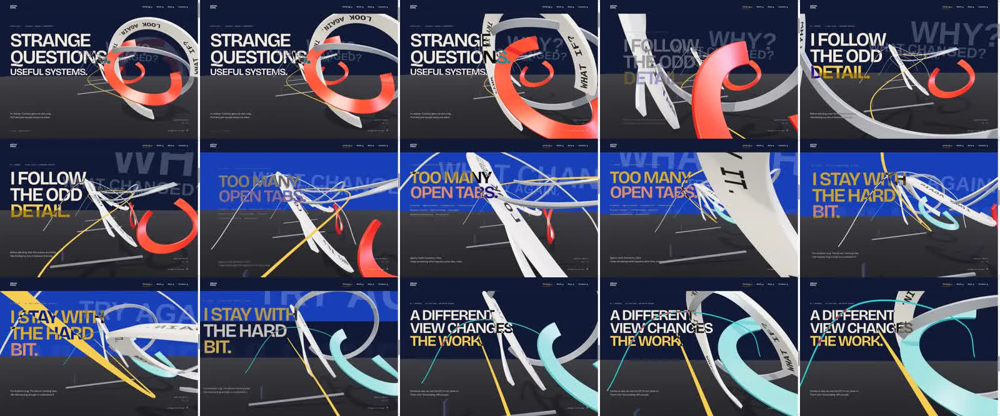

# Continuous identity journey — build and review

## Visible result

The default homepage is now a single scroll-driven personal journey before Work. It replaces the separate entrance, hero Key selector, branching buttons, draggable curiosity labels, destruction demo and collaboration toggle. Their source remains available; none of those widgets is mounted by `page.tsx`.

The visitor scrolls through **question → observe → connect → refine → another perspective**. A 38° perspective camera moves from Z=13 to Z=−33 through four spatial stations. The same three-part Question Relay separates, changes orientation, compresses into an aligned assembly and gains a cyan counter-perspective. Print moves with its UVs. WHY / WHAT CHANGED / TRY AGAIN exist as decorative depth-tested lettering inside the world. All actual information stays in server-rendered HTML.

## Files

- `src/app/page.tsx`: mounts the new identity journey; retains Work, Now and Contact.
- `src/app/experience.module.css`: persistent solid navigation, contrasting active/focus states and practical wordmark target.
- `src/components/journey/identity-journey.tsx`: server copy, semantic headings, verified interests and direct navigation.
- `journey-motion.tsx`: GSAP/ScrollTrigger controller, one shared numeric pose, chapter composition, pointer response, visibility and reduced-motion lifecycle.
- `spatial-journey.tsx`: lazy R3F world, camera path, printed Blender parts, depth lettering, environment, shadows and demand rendering.
- `journey.module.css`: separate desktop/mobile composition and readable default document.
- `scripts/blender/build-question-relay.py`: reproducible original geometry and UV authoring.
- `public/models/question-relay.glb`, `question-relay.json`, `ASSETS.md`: asset, measured report and provenance.
- `DESIGN.md` §21 and `README.md`: current contract and run instructions.
- `CURRENT_PROBLEMS.md`, `RESOURCE_MAP.md`, `EXPERIENCE_ROADMAP.md`: recording audit, coding references, resource choices and remaining work.

## Three reviews

### Design — ui-ux-pro-max

The initial rendering had three problems: similar circular silhouettes at every station, pale geometry reducing headline/nav contrast, and overlapping chapter text. Iteration changed part orientations/scales, protected navigation with a solid field, separated chapter transitions and added registered physical print. Difference blending lets the copy change ink where a surface crosses it. Small text is white before blending: approximately **4.94:1** over the cobalt field after blending. Dynamic overlaps still deserve visual attention; this is not a claim of exhaustive contrast certification at every frame.

The camera now creates foreground passes and reveals another destination behind the current subject. Native scroll reverses that choreography. The middle is deliberately more intense than the quiet Work/Now/contact sections. The space influence comes from framing and distance, not decorative stars or invented personal interests.

### UX — ui-design

- Inspected rendered states at 1440, 1024, 768, 390 and 320px; no horizontal overflow.
- PageDown advances the scene; touch swipe advances it without drag controls or scroll interception.
- Work is directly reachable with keyboard Enter; visible focus is preserved. Direct `#work` landed around 98px below the viewport top on the tested phone-sized layout, clear of the persistent header.
- Native anchors for Thinking, Curiosity, Building and Collaboration remain available. No sound, game completion or WebGL interaction gates content.
- Reduced motion: normal chapter document, zero canvases. Live preference changes restore one canvas and remove it again correctly.
- No JavaScript: all five headings/captions and email are readable in the normal document.
- Forced WebGL failure: SVG remains, text/navigation remain available, the scene boundary handles the renderer failure.
- Browser accessibility tree contains all five correctly spaced heading names, including visually inactive chapters. All essential text is outside the canvas. This is browser-tree inspection, not a completed assistive-technology user study.

### Engineering — react / nextjs / tailwind / vercel-react-best-practices

- Server component owns copy. Only controller and renderer are client islands; `next/dynamic` lazy-loads the scene from the client boundary.
- No new dependencies. GSAP's existing ScrollTrigger plugin supplies progress; CSS sticky supplies the stage. Existing Lenis smooths wheel input and leaves touch/anchors native.
- Transient camera, object, pointer and typography motion uses refs, imperative Three transforms and GSAP setters. No per-frame React state.
- One model download; geometry reused in twelve mesh instances across four stations. Named parts remain independently transformable. No physics engine, postprocessing chain, external HDRI or texture download.
- Generated texture/material/environment resources and listeners/timelines are cleaned up on unmount. The small loader cache intentionally retains the source model during the page session. A full heap/leak profiler was not run.
- DPR changes with the breakpoint. At simulated density 3, phone-width canvas DPR was 1. At desktop density 2, canvas width confirmed approximately 1.5 DPR. Shadow maps are 1024 desktop /512 mobile.
- Production build and ESLint pass. Normal viewport, final and motion runs reported no console errors or exceptions. Forced WebGL failure produced expected caught renderer errors.

## Measured performance

- Model: **191,444 bytes**, **154,702 bytes** gzip level 9; **10,452 triangles**, three named source meshes.
- Aggregate `.next/static` JavaScript gzip level 9: **487,635 bytes**, versus prior **508,413 bytes** (20,778 bytes smaller). This aggregate includes all generated JS chunks; it is **not an initial-route transfer measurement**.
- Uncaptured local native Intel Iris Xe headless run, 1440×1000 DPR1: **529 RAF samples over 8.816s**, median/p95 **16.7ms**, p99/max **16.8ms**, no sampled interval over 35ms.
- Observed moving-scene sample peak: **36 draw calls /66,824 rendered triangles**, including shadow work. These are sampled renderer counters, not unique model geometry or a universal worst case.
- Settled GPU draw count: **zero additional frames** in all five viewport checks and the motion/profiling runs.
- Recorded run: 550 actual browser screencast frames. Median/p95 16.7ms, one maximum gap of **266.6ms**. The uncaptured repeat did not reproduce that gap; capture/startup overhead is a possible cause, not conclusively isolated.
- These results describe this machine's headless native GPU backend. They do not establish physical-phone performance, Core Web Vitals, cold-load behavior or a hardware-wide FPS guarantee. SwiftShader checks were much slower and are not used to claim smoothness.

## Local QA artifacts

`visual-qa/spatial-journey/` (ignored generated artifacts):

- `{width}-{0,21,42,63,86,100}.png` for all five widths.
- `report-{width}.json`, `final-check.json`, `modes.json`.
- `reduced-390.png`, `no-js-390.png`, `fallback-390.png`, `work-390.png`.
- `journey-motion.mp4`: 19.27s actual browser screencast, approximately 8.58 MB. It is a review artifact, not shipped on the website.
- `journey-contact-sheet.jpg`, original `motion-frames/`, `motion-report.json`, `profile.json`.

The three compressed review images above are checked into `docs/media`; full screenshots/video remain local. Historical captures and the supplied recordings are preserved.

## Remaining weaknesses

- Close passes can crowd the composition on narrow screens. The readable document mode is calm; further phone art direction should refine those intervals rather than add more objects.
- Geometry remains abstract. Future project-specific interaction should add meaning and concrete evidence instead of endlessly reusing the same ribbon.
- Work/Now/contact retain their quieter existing implementations. A later transition into Work can connect the spatial journey more directly to the evidence.
- Cold startup, real phones, battery impact and the one recorded long frame still need targeted profiling. No audio was added.

The result is a substantial change in the actual default website; it is not a claim that the entire portfolio has reached Lusion's craft standard.
